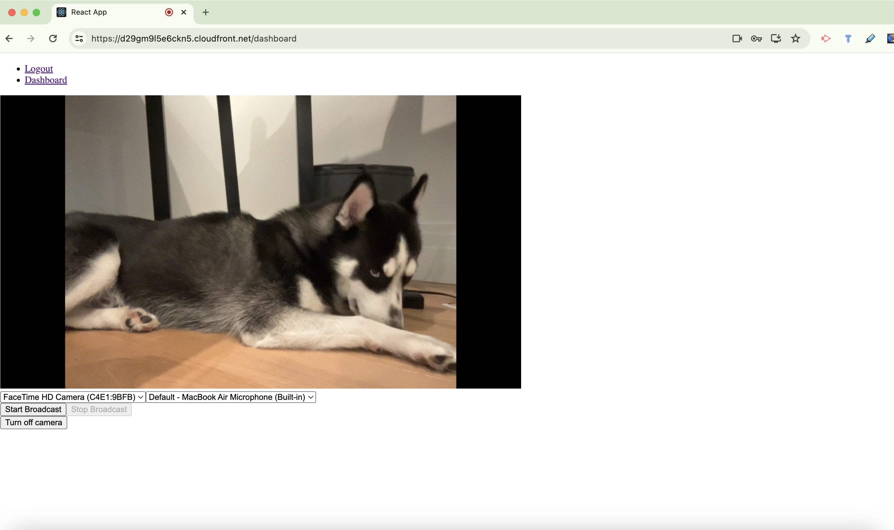
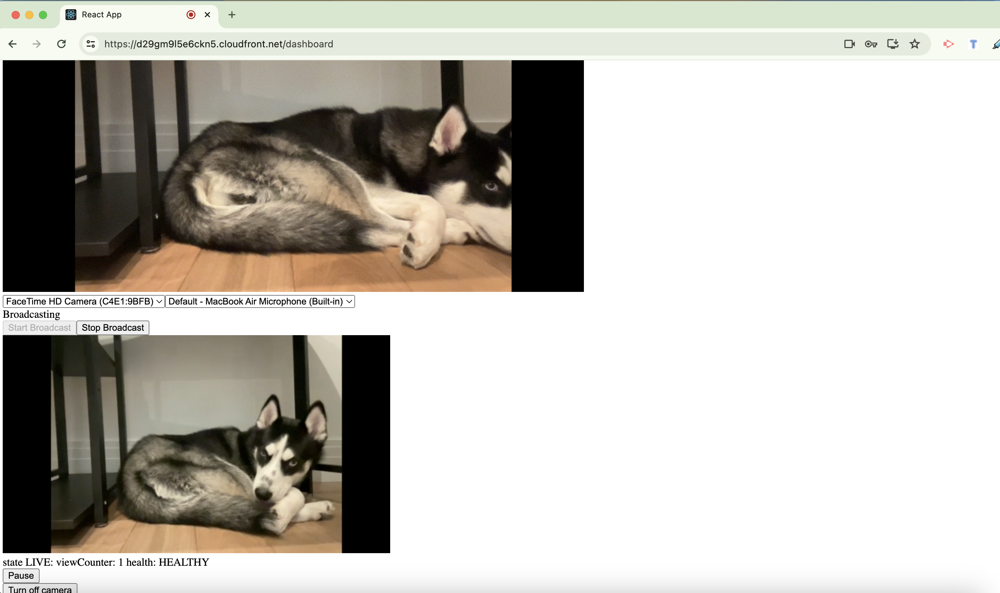

## Introduction
This project is designed for learning and implementing AWS Interactive Video Service (IVS) along with its SDK. It focuses on using AWS Cognito Identity Pool and User Pool for authentication setup. Although ideally managed by a backend server, this project handles all functionalities, including security and streaming, directly from the frontend for educational purposes.

The application leverages device input and utilizes the [Amazon IVS Web Broadcast SDK](https://aws.amazon.com/blogs/media/broadcast-from-a-browser-with-the-amazon-ivs-web-broadcast-sdk/) to stream media to IVS. It features real-time playback using IVS's HLS format and stores the stream video on AWS S3. 

**Key Features:**
- Live broadcast streaming.
- Real-time playback in HLS format.
- Video storage on S3.


### Project UI Snapshots
<div style="display: flex; justify-content: space-between;">
  <figure>
    
    <figcaption>Broadcast Stopped</figcaption>
  </figure>
  <figure>
    
    <figcaption>Broadcast Started</figcaption>
  </figure>
</div>

**Note:** This project's security and streaming are handled solely on the UI. This is not the optimal solution for production environments but is suitable for the project's educational nature.

## Deployed Demo
The core functionality and infrastructure of the project are set up, although styling is pending. Access the demo at the CloudFront distribution URL: [IVS UI App Demo](https://d29gm9l5e6ckn5.cloudfront.net).

To use the demo:
- Register and confirm your account via email.

## Run Locally
To run the project locally:

### Infrastructure
1. Ensure Terraform is installed. The infrastructure is provisioned via Terraform and set up to run on GitHub Actions.
2. Navigate to the Terraform directory and execute the following commands:

```bash
cd terraform-infra
terraform init
terraform plan
terraform apply
```

### UI React app
3. Collect necessary IDs, keys, and values from Terraform outputs and update them in the [env.example](env.example) file.
4. Install dependencies:

```bash
npm install
```

5. To start the React app:

```bash
npm start
```


## GitHub Action CI/CD
The project includes two workflows:
1. [IVS Livestream App Build and Deploy](.github/workflows/react_app_build_deploy.yaml) - For infrastructure changes.
2. [Build and Deploy React App](.github/workflows/react_app_build_deploy.yaml) - For UI code changes.

These workflows are configured for manual execution post-merge into the main branch. The CI/CD process is integrated with AWS via OIDC, eliminating the need for storing AWS credentials. 

For setup in your own repository, create a role for GitHub Actions in your AWS account following [this guide](https://docs.github.com/en/actions/deployment/security-hardening-your-deployments/configuring-openid-connect-in-amazon-web-services).

### Bugs and Improvements for V1
Current areas for improvement include:
1. Ensuring consistent activation of real-time video playback.
2. Enabling screen-share broadcasting.
3. Adding Tailwind CSS for enhanced styling.

## Technology Stack

- Terraform: Utilized for infrastructure as code, ensuring reliable and repeatable deployment of cloud resources.
- Amazon Web Services (AWS): Key services used include:
    - AWS Interactive Video Service (IVS) for live streaming capabilities.
    - AWS Cognito for user authentication and management.
    - AWS S3 for secure and scalable storage of streaming content.
- React: A powerful JavaScript library employed for building dynamic and responsive user interfaces.
- TypeScript: Integrated with React for adding static typing to JavaScript, enhancing the development process by improving code quality and maintainability.